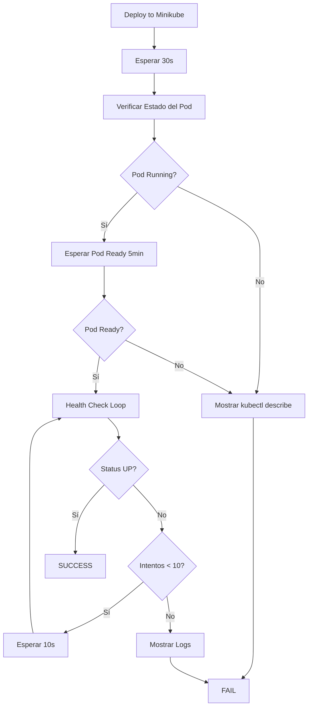

# Resumen: Implementación de Etapa Health Check en Pipelines Jenkins

## 📋 Descripción General

Se agregó una nueva etapa **"🏥 Health Check en Minikube"** a todos los pipelines individuales de servicios (`*-dev.groovy`). Esta etapa verifica que los servicios desplegados en Minikube estén completamente operativos antes de continuar con el pipeline.

## ✅ Archivos Modificados

1. ✅ `user-service/jenkins/user-service-dev.groovy`
2. ✅ `product-service/jenkins/product-service-dev.groovy`
3. ✅ `order-service/jenkins/order-service-dev.groovy`
4. ✅ `payment-service/jenkins/payment-service-dev.groovy`
5. ✅ `shipping-service/jenkins/shipping-service-dev.groovy`
6. ✅ `service-discovery/jenkins/service-discovery-dev.groovy`
7. ✅ `favourite-service/jenkins/favourite-service-dev.groovy`

## 🎯 Funcionalidades de la Etapa Health Check

### 1. **Verificación de Estado del Pod**
- Muestra el estado actual del pod desplegado
- Utiliza `kubectl get pods` para ver el estado completo

### 2. **Espera de Readiness**
- Espera hasta 5 minutos (300s) a que el pod esté en estado `Ready`
- Si el pod no está listo en ese tiempo, muestra detalles con `kubectl describe`
- Falla el pipeline si el timeout se alcanza

### 3. **Verificación del Health Endpoint**
- Realiza hasta **10 intentos** para verificar el endpoint `/actuator/health`
- Espera 10 segundos entre cada intento
- Busca el estado `"status":"UP"` en la respuesta JSON
- Muestra la respuesta completa del health check cuando es exitoso

### 4. **Manejo de Errores**
- Si el health check falla después de todos los intentos:
  - Muestra los últimos 50 líneas de logs del servicio
  - Falla el pipeline con código de salida 1
  - Proporciona información detallada para debugging

### 5. **Endpoint Específico por Servicio**
- **Microservicios** (user, product, order, payment, shipping, favourite):
  ```
  http://localhost:{PORT}/{SERVICE_NAME}/actuator/health
  ```
  Ejemplo: `http://localhost:8085/user-service/actuator/health`

- **Service Discovery** (Eureka):
  ```
  http://localhost:8761/actuator/health
  ```
  (No usa prefijo de servicio)

## 🔧 Configuración Técnica

### Puertos por Servicio
```groovy
def servicePorts = [
  'user-service': '8085',
  'product-service': '8083',
  'order-service': '8081',
  'payment-service': '8082',
  'shipping-service': '8084',
  'favourite-service': '8086',
  'service-discovery': '8761'
]
```

### Tiempos de Espera
- **Inicialización**: 30 segundos después del despliegue
- **Pod Ready**: Hasta 300 segundos (5 minutos)
- **Health Check**: 10 intentos × 10 segundos = 100 segundos máximo

### Condiciones de Ejecución
La etapa solo se ejecuta cuando:
```groovy
when {
  expression { return params.DEPLOY_TO_MINIKUBE?.toString()?.toBoolean() }
}
```

## 🚀 Flujo de Ejecución



## 📊 Output Esperado

### Éxito ✅
```
🏥 Verificando salud del servicio user-service en Minikube...
⏳ Esperando 30 segundos para que el servicio se inicialice...
🔍 Verificando estado del deployment...
📦 Estado del pod:
NAME                           READY   STATUS    RESTARTS   AGE
user-service-6fbcb768b9-n7qvc  1/1     Running   4          100m

⏳ Esperando a que el pod esté listo...
pod/user-service-6fbcb768b9-n7qvc condition met

🏥 Verificando health endpoint...
✅ Servicio user-service está UP
{
  "status" : "UP",
  "components" : {
    "db" : { "status" : "UP" },
    "discoveryComposite" : { "status" : "UP" },
    ...
  }
}
━━━━━━━━━━━━━━━━━━━━━━━━━━━━━━━━━━
✅ Health check exitoso para user-service
━━━━━━━━━━━━━━━━━━━━━━━━━━━━━━━━━━
```

### Fallo ❌
```
🏥 Verificando health endpoint...
⚠️  Intento 1/10 - Servicio no está listo aún...
⚠️  Intento 2/10 - Servicio no está listo aún...
...
⚠️  Intento 10/10 - Servicio no está listo aún...
❌ Health check falló después de 10 intentos
📋 Logs del servicio:
[últimas 50 líneas de logs]
```

## 🔍 Verificación Manual

Para verificar manualmente la salud de los servicios en Minikube (SSH a la VM):

```bash
# Ver todos los pods
kubectl get pods -n ecommerce

# Ver estado detallado
kubectl get pods -n ecommerce -o wide

# Health check de Service Discovery
kubectl exec -n ecommerce deployment/service-discovery -- \
  curl -s http://localhost:8761/actuator/health

# Health check de Order Service
kubectl exec -n ecommerce deployment/order-service -- \
  curl -s http://localhost:8081/order-service/actuator/health

# Health check de Payment Service
kubectl exec -n ecommerce deployment/payment-service -- \
  curl -s http://localhost:8082/payment-service/actuator/health

# Health check de Product Service
kubectl exec -n ecommerce deployment/product-service -- \
  curl -s http://localhost:8083/product-service/actuator/health

# Health check de Shipping Service
kubectl exec -n ecommerce deployment/shipping-service -- \
  curl -s http://localhost:8084/shipping-service/actuator/health

# Health check de User Service
kubectl exec -n ecommerce deployment/user-service -- \
  curl -s http://localhost:8085/user-service/actuator/health

# Health check de Favourite Service
kubectl exec -n ecommerce deployment/favourite-service -- \
  curl -s http://localhost:8086/favourite-service/actuator/health
```

## 🏗️ Arquitectura de la Solución

### Infraestructura
```
┌─────────────────┐
│  Jenkins Server │
│   (Orquestador) │
└────────┬────────┘
         │
    SSH Conexión
         │
┌────────┴────────────────────────────┐
│                                     │
│  ┌──────────────┐  ┌─────────────┐ │
│  │   VM BUILD   │  │ VM MINIKUBE │ │
│  │   (Test &    │  │  (Deploy &  │ │
│  │   Build)     │  │   Runtime)  │ │
│  └──────────────┘  └──────┬──────┘ │
│                           │         │
│                    ┌──────┴──────┐  │
│                    │   Minikube  │  │
│                    │   Cluster   │  │
│                    └─────────────┘  │
│                                     │
└─────────────────────────────────────┘
       DigitalOcean Infrastructure
```

### Flujo de Health Check
1. **Jenkins** → Conecta vía SSH a **VM Minikube**
2. **VM Minikube** → Ejecuta `kubectl` comandos en el **cluster Minikube**
3. **kubectl exec** → Ejecuta `curl` dentro del **pod del servicio**
4. **Pod** → Responde con el estado del health endpoint
5. **Resultado** → Se propaga de vuelta a Jenkins

## 💡 Beneficios

1. ✅ **Detección Temprana de Problemas**: Identifica servicios con problemas antes de marcar el pipeline como exitoso
2. ✅ **Feedback Claro**: Proporciona información detallada sobre el estado de salud
3. ✅ **Reintentos Inteligentes**: No falla inmediatamente, da tiempo a los servicios para inicializarse
4. ✅ **Logs Automáticos**: En caso de fallo, muestra automáticamente los logs para debugging
5. ✅ **Consistencia**: Misma implementación en todos los servicios
6. ✅ **Integración con Spring Boot Actuator**: Utiliza los endpoints estándar de Spring Boot

## 🎯 Próximos Pasos (Opcional)

1. Agregar verificación de métricas adicionales (memoria, CPU)
2. Implementar alertas cuando los health checks fallen
3. Guardar historial de health checks en artefactos de Jenkins
4. Agregar verificación de conectividad entre servicios
5. Implementar smoke tests después del health check

## 📝 Notas Importantes

- La etapa se ejecuta **solo si `DEPLOY_TO_MINIKUBE=true`**
- Se requiere acceso SSH a la VM de Minikube
- Los servicios deben tener habilitado Spring Boot Actuator
- El namespace de Kubernetes debe ser `ecommerce`
- Se asume que `kubectl` está configurado en la VM Minikube

---

**Fecha de Implementación**: 31 de Octubre, 2025  
**Implementado por**: GitHub Copilot  
**Estado**: ✅ Completado
