# Pipelines de Staging - Guía de Uso

## 📋 Descripción General

Los pipelines de staging están diseñados para desplegar servicios en el ambiente de **staging** en GKE (Google Kubernetes Engine). Estos pipelines toman las imágenes de Docker Hub que fueron construidas y subidas por los pipelines de desarrollo (`-dev`).

## 🎯 Servicios con Pipeline de Staging

Los siguientes servicios tienen pipelines de staging configurados:

| Servicio | Pipeline | Puerto | Docker Hub |
|----------|----------|--------|------------|
| user-service | `user-service-stage.groovy` | 8085 | `${DOCKER_USER}/user-service:${TAG}` |
| product-service | `product-service-stage.groovy` | 8083 | `${DOCKER_USER}/product-service:${TAG}` |
| order-service | `order-service-stage.groovy` | 8081 | `${DOCKER_USER}/order-service:${TAG}` |
| payment-service | `payment-service-stage.groovy` | 8082 | `${DOCKER_USER}/payment-service:${TAG}` |
| shipping-service | `shipping-service-stage.groovy` | 8084 | `${DOCKER_USER}/shipping-service:${TAG}` |
| favourite-service | `favourite-service-stage.groovy` | 8086 | `${DOCKER_USER}/favourite-service:${TAG}` |
| service-discovery | `service-discovery-stage.groovy` | 8761 | `${DOCKER_USER}/service-discovery:${TAG}` |

## 🔄 Flujo de Trabajo

### 1. Pipeline Dev (Desarrollo)
```
develop/feat/* branch → Tests → Build → Push a Docker Hub → Deploy a Minikube
```

### 2. Pipeline Stage (Staging)
```
staging branch → Pull de Docker Hub → Deploy a GKE Staging → Health Check
```

## ⚙️ Parámetros de Configuración

Cada pipeline de staging acepta los siguientes parámetros:

| Parámetro | Valor por Defecto | Descripción |
|-----------|-------------------|-------------|
| `DOCKER_IMAGE_TAG` | `latest` | Tag de la imagen en Docker Hub a desplegar |
| `GKE_CLUSTER_NAME` | `ecommerce-dev-gke-v2` | Nombre del cluster GKE |
| `GKE_LOCATION` | `us-central1-a` | Zona o región del cluster GKE |
| `K8S_NAMESPACE` | `staging` | Namespace de Kubernetes donde se desplegará |
| `REPLICA_COUNT` | `1` | Número de réplicas del servicio |

## 🚀 Cómo Usar los Pipelines

### Opción 1: Desplegar con Tag Específico

1. Ejecuta el pipeline dev en rama `develop` o `feat/*` para generar una imagen
2. Anota el tag generado (ej: `abc1234-build-123`)
3. Haz merge a `staging`
4. El pipeline stage se ejecutará automáticamente
5. O puedes ejecutarlo manualmente con el tag específico:
   - `DOCKER_IMAGE_TAG` = `abc1234-build-123`

### Opción 2: Desplegar con Latest

1. Ejecuta el pipeline dev en rama `develop`
2. Este sube la imagen con tags: `latest`, `${TAG}`, `${TAG}-build-${BUILD_NUMBER}`
3. Haz merge a `staging`
4. El pipeline stage se ejecutará usando la imagen `latest`

## 📦 Recursos Desplegados

Cada pipeline de staging crea/actualiza los siguientes recursos en GKE:

### Deployment
```yaml
apiVersion: apps/v1
kind: Deployment
metadata:
  name: ${SERVICE_NAME}
  namespace: staging
spec:
  replicas: 1  # configurable
  template:
    spec:
      containers:
      - name: ${SERVICE_NAME}
        image: ${DOCKER_USER}/${SERVICE_NAME}:${TAG}
        ports:
        - containerPort: ${SERVICE_PORT}
        resources:
          requests:
            cpu: 200m
            memory: 512Mi
          limits:
            cpu: 500m
            memory: 1Gi
        livenessProbe:
          httpGet:
            path: /${SERVICE_NAME}/actuator/health
            port: ${SERVICE_PORT}
          initialDelaySeconds: 60
        readinessProbe:
          httpGet:
            path: /${SERVICE_NAME}/actuator/health
            port: ${SERVICE_PORT}
          initialDelaySeconds: 30
```

### Service
```yaml
apiVersion: v1
kind: Service
metadata:
  name: ${SERVICE_NAME}
  namespace: staging
spec:
  type: ClusterIP
  selector:
    app: ${SERVICE_NAME}
  ports:
  - port: ${SERVICE_PORT}
    targetPort: ${SERVICE_PORT}
```

## 🔍 Stages del Pipeline

### 1. Validate Branch
- Valida que el pipeline se ejecute solo en rama `staging`
- Omite la ejecución en otras ramas

### 2. Checkout
- Hace checkout del código fuente
- Muestra el workspace actual

### 3. Check for Service Changes
- Detecta si hay cambios en el servicio específico
- Omite el pipeline si no hay cambios relevantes
- También detecta cambios en archivos compartidos (`pom.xml`, `jenkins/`, `.github/`)

### 4. Deploy to GKE Staging
- Se autentica con GCP usando service account
- Configura kubectl para el cluster GKE
- Crea el namespace `staging` si no existe
- Aplica el Deployment y Service
- Espera hasta 5 minutos a que el deployment esté disponible

### 5. Health Check
- Ejecuta curl al endpoint `/actuator/health` dentro del pod
- Realiza hasta 12 reintentos (2 minutos total)
- Verifica que el status sea `"UP"`
- Si falla, muestra los logs del pod

## 🔐 Credenciales Requeridas

Los pipelines de staging requieren las siguientes credenciales configuradas en Jenkins:

| Credencial | ID | Tipo | Descripción |
|------------|-----|------|-------------|
| GCP Project ID | `gcp-project-id` | Secret Text | ID del proyecto GCP |
| GCP Service Account | `gcp-service-account` | Secret File | JSON con credenciales de service account |
| Docker Hub User | `docker-user` | Secret Text | Usuario de Docker Hub |
| GitHub Token | `github-token` | Secret Text | Token para actualizar status en GitHub |

## 📊 Monitoreo y Verificación

### Verificar Deployment
```bash
# Conectarse al cluster
gcloud container clusters get-credentials ecommerce-dev-gke-v2 \
  --zone us-central1-a \
  --project devops-activity

# Ver deployments en staging
kubectl get deployments -n staging

# Ver pods
kubectl get pods -n staging

# Ver servicios
kubectl get services -n staging
```

### Verificar Health de un Servicio
```bash
# Health check directo
kubectl exec -n staging deployment/user-service -- \
  curl -s http://localhost:8085/user-service/actuator/health
```

### Ver Logs
```bash
# Logs del servicio
kubectl logs -n staging deployment/user-service --tail=100 -f
```

## 🎯 Configurar Jenkins

### Crear Jobs Multibranch Pipeline

Para cada servicio, crea un job Multibranch Pipeline en Jenkins:

1. **New Item** → `${SERVICE_NAME}-stage` → **Multibranch Pipeline**

2. **Branch Sources**:
   - **Git**
   - Repository URL: `https://github.com/OscarMURA/ecommerce-microservice-backend-app.git`
   - Credentials: `github-token`
   - Behaviors:
     - Discover branches: `Filter by name (with regular expression)`
     - Include: `staging`

3. **Build Configuration**:
   - Mode: `by Jenkinsfile`
   - Script Path: `${SERVICE_NAME}/jenkins/${SERVICE_NAME}-stage.groovy`

4. **Scan Multibranch Pipeline Triggers**:
   - Periodically if not otherwise run: `1 hour`

## ⚡ Tips y Mejores Prácticas

### 1. Usar Tags Específicos en Producción
Para staging puedes usar `latest`, pero para producción siempre usa tags específicos:
```
DOCKER_IMAGE_TAG = "v1.2.3" o "abc1234"
```

### 2. Rollback Rápido
Si un despliegue falla, puedes hacer rollback ejecutando el pipeline con el tag anterior:
```
DOCKER_IMAGE_TAG = "abc1234-build-122"  # versión anterior
```

### 3. Escalado Horizontal
Para aumentar réplicas en staging:
```
REPLICA_COUNT = 2
```

### 4. Debugging
Si el health check falla:
1. Ver logs del pod: `kubectl logs -n staging deployment/${SERVICE_NAME}`
2. Describir el pod: `kubectl describe pod -n staging -l app=${SERVICE_NAME}`
3. Verificar eventos: `kubectl get events -n staging`

## 🔄 Integración Continua

### Flujo Completo

```mermaid
graph LR
    A[Commit a develop] --> B[Pipeline Dev]
    B --> C[Tests Pass]
    C --> D[Build Image]
    D --> E[Push a Docker Hub]
    E --> F[Deploy a Minikube]
    F --> G[Merge a staging]
    G --> H[Pipeline Stage]
    H --> I[Pull de Docker Hub]
    I --> J[Deploy a GKE Staging]
    J --> K[Health Check]
    K --> L[Ready for Prod]
```



## 📝 Notas Importantes

1. **Namespace Staging**: El namespace `staging` se crea automáticamente si no existe
2. **ImagePullPolicy**: Configurado como `Always` para asegurar que se descargue la última versión
3. **Resource Limits**: Cada servicio tiene límites de CPU (500m) y memoria (1Gi)
4. **Probes**: Configurados con tiempos razonables para evitar kill prematuro de pods
5. **Service Discovery**: El servicio `service-discovery` usa `/actuator/health` directamente (sin prefijo del nombre del servicio)

## 🆘 Troubleshooting

### Problema: "Image pull failed"
**Solución**: Verifica que la imagen exista en Docker Hub:
```bash
docker pull ${DOCKER_USER}/${SERVICE_NAME}:${TAG}
```

### Problema: "Health check failed"
**Solución**: 
1. Verifica que el servicio esté corriendo: `kubectl get pods -n staging`
2. Revisa logs: `kubectl logs -n staging deployment/${SERVICE_NAME}`
3. Verifica el endpoint: `kubectl exec -n staging deployment/${SERVICE_NAME} -- curl localhost:${PORT}/actuator/health`

### Problema: "Timeout waiting for deployment"
**Solución**:
1. Aumenta los límites de recursos si el pod no tiene suficiente memoria/CPU
2. Verifica que la imagen sea compatible con la arquitectura del cluster
3. Revisa los eventos: `kubectl describe deployment -n staging ${SERVICE_NAME}`

## 📚 Referencias

- [Kubernetes Deployments](https://kubernetes.io/docs/concepts/workloads/controllers/deployment/)
- [GKE Best Practices](https://cloud.google.com/kubernetes-engine/docs/best-practices)
- [Spring Boot Actuator](https://docs.spring.io/spring-boot/docs/current/reference/html/actuator.html)

